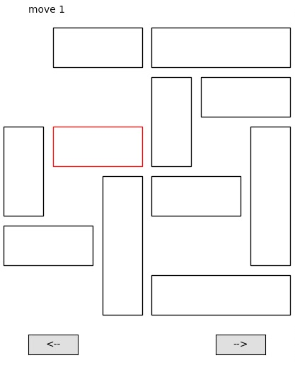

# unblock-car-puzzle-solver

Solves "Unblock Me" or "Sliding Cars" sort of puzzles then lets you interact with an animation of the solution!

The most direct solution (fewest moves) can be searched for.

You can choose how "moves" are defined/counted: should every move be counted, or should sequential moves of the same car collectively count as 1 move?

To use, enter level information into solve.cpp, then run solve.cpp to output a file containing the solution.
Then, to optionally help you view the solution, run animate.py for a quick animation and user-controlled mode (the matplotlib module is needed).

solve.cpp performs a brute-force search, yet it is **very fast** for many reasons: (1) uniqueConfigurations\[\] prevents runtime from growing exponentially, (2) I use a low-level compiled langauge such as C++ instead of MATLAB or Python, (3) much data such as sol\[\] and uniqueConfigurations\[\] were made to be global, (4) the user can set the nMax parameter to not consider solutions that are more than nMax moves, (5) etc.
